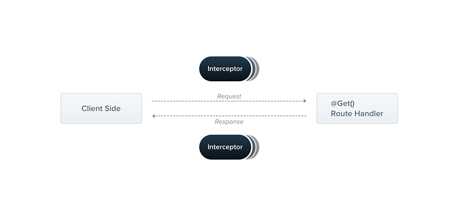

## Interceptors

An interceptor is a class annotated with the `@Injectable()` decorator and implements the `NestInterceptor` interface.

Interceptors have a set of useful capabilities which are inspired by the **Aspect Oriented Programming** (AOP) technique. They make it possible to:

- bind extra logic before / after method execution
- transform the result returned from a function
- transform the exception thrown from a function
- extend the basic function behavior
- completely override a function depending on specific conditions (e.g., for caching purposes)

## Basics

Each interceptor implements the `intercept()` method, which takes two arguments. The first one is the `ExecutionContext` instance (exactly the same object as for **guards**). The `ExecutionContext` inherits from `ArgumentsHost`. We saw `ArgumentsHost` before in the exception filters chapter. There, we saw that it's a wrapper around arguments that have been passed to the original handler, and contains different arguments arrays based on the type of the application. You can refer back to the **exception filters** for more on this topic.

## Execution context

By extending `ArgumentsHost`, `ExecutionContext` also adds several new helper methods that provide additional details about the current execution process. These details can be helpful in building more generic interceptors that can work across a broad set of controllers, methods, and execution contexts.
