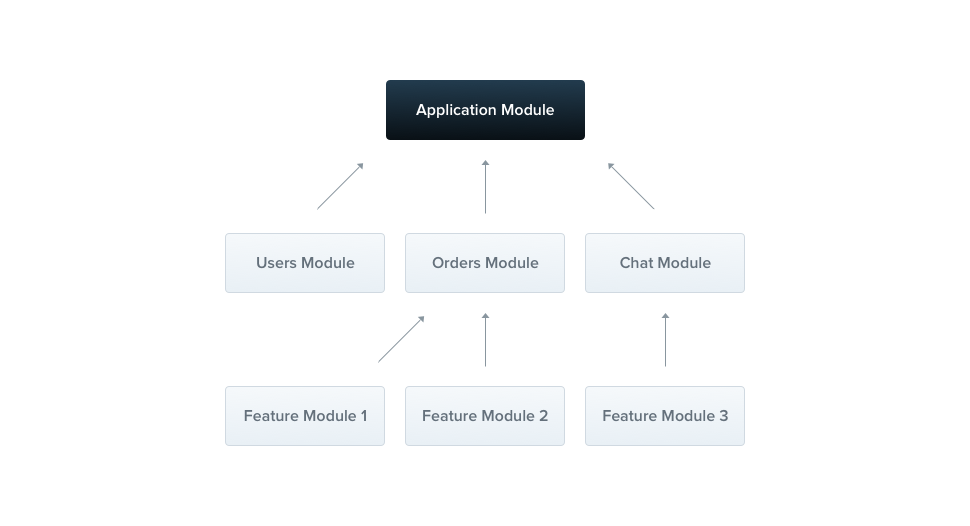

## Modules

A module is a class that is annotated with the `@Module()` decorator. This decorator provides metadata that **Nest** uses to organize and manage the application structure efficiently.

Every Nest application has at least one module, the **root module**, which serves as the starting point for Nest to build the **application graph**. This graph is an internal structure that Nest uses to resolve relationships and dependencies between modules and providers. While small applications might only have a root module, this is generally not the case. Modules are **highly recommended** as an effective way to organize your components. For most applications, you'll likely have multiple modules, each encapsulating a closely related set of **capabilities**.

The `@Module()` decorator takes a single object with properties that describe the module:

| Property        | Description                                                                                                                                                                                              |
| --------------- | -------------------------------------------------------------------------------------------------------------------------------------------------------------------------------------------------------- |
| **providers**   | the providers that will be instantiated by the Nest injector and may be shared at least across this module                                                                                               |
| **controllers** | the set of controllers defined in this module which have to be instantiated                                                                                                                              |
| **imports**     | the list of imported modules that export the providers which are required in this module                                                                                                                 |
| **exports**     | the subset of `providers` that are provided by this module and should be available in other modules which import this module. You can use either the provider itself or just its token (`provide` value) |

The module **encapsulates** providers by default, meaning you can only inject providers that are either part of the current module or explicitly exported from other imported modules. The exported providers from a module essentially serve as the module's public interface or API.
