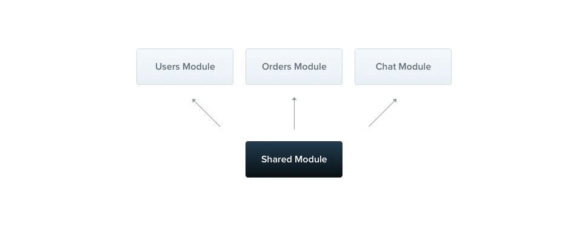

## Modules

A module is a class that is annotated with the `@Module()` decorator. This decorator provides metadata that **Nest** uses to organize and manage the application structure efficiently.


Every Nest application has at least one module, the **root module**, which serves as the starting point for Nest to build the **application graph**. This graph is an internal structure that Nest uses to resolve relationships and dependencies between modules and providers. While small applications might only have a root module, this is generally not the case. Modules are **highly recommended** as an effective way to organize your components. For most applications, you'll likely have multiple modules, each encapsulating a closely related set of **capabilities**.

The `@Module()` decorator takes a single object with properties that describe the module:

| Property        | Description                                                                                                                                                                                              |
| --------------- | -------------------------------------------------------------------------------------------------------------------------------------------------------------------------------------------------------- |
| **providers**   | the providers that will be instantiated by the Nest injector and may be shared at least across this module                                                                                               |
| **controllers** | the set of controllers defined in this module which have to be instantiated                                                                                                                              |
| **imports**     | the list of imported modules that export the providers which are required in this module                                                                                                                 |
| **exports**     | the subset of `providers` that are provided by this module and should be available in other modules which import this module. You can use either the provider itself or just its token (`provide` value) |

The module **encapsulates** providers by default, meaning you can only inject providers that are either part of the current module or explicitly exported from other imported modules. The exported providers from a module essentially serve as the module's public interface or API.

## Feature modules

In our example, the `KeonksController` and `KeonksService` are closely related and serve the same application domain. It makes sense to group them into a feature module. A feature module organizes code that is relevant to a specific feature, helping to maintain clear boundaries and better organization. This is particularly important as the application or team grows, and it aligns with the **SOLID** principles.

Next, we'll create the **KeonksModule** to demonstrate how to group the controller and service.

```ts
keonks / keonks.module.ts;

import { Module } from '@nestjs/common';
import { KeonksController } from './keonks.controller';
import { KeonksService } from './keonks.service';

@Module({
  controllers: [KeonksController],
  providers: [KeonksService],
})
export class KeonksModule {}
```

> **Hint**
> To create a module using the CLI, simply execute the `$ nest g module keonks` command.

Above, we defined the `KeonksModule` in the `keonks.module.ts` file, and moved everything related to this module into the `keonks` directory. The last thing we need to do is import this module into the root module (the `AppModule`, defined in the `app.module.ts` file).

```ts
app.module.ts;

import { Module } from '@nestjs/common';
import { KeonksModule } from './keonks/keonks.module';

@Module({
  imports: [KeonksModule],
})
export class AppModule {}
```

Here is how our directory structure looks now:


## Shared modules

In Nest, modules are **singletons** by default, and thus you can share the same instance of any provider between multiple modules effortlessly.



Every module is automatically a **shared module**. Once created it can be reused by any module. Let's imagine that we want to share an instance of the `KeonksService` between several other modules. In order to do that, we first need to **export** the `KeonksService` provider by adding it to the module's `exports` array, as shown below:

```ts
keonks.module.ts;

import { Module } from '@nestjs/common';
import { KeonksController } from './keonks.controller';
import { KeonksService } from './keonks.service';

@Module({
  controllers: [KeonksController],
  providers: [KeonksService],
  exports: [KeonksService],
})
export class KeonksModule {}
```

Now any module that imports the `KeonksModule` has access to the `KeonksService` and will share the same instance with all other modules that import it as well.

If we were to directly register the `KeonksService` in every module that requires it, it would indeed work, but it would result in each module getting its own separate instance of the `KeonksService`. This can lead to increased memory usage since multiple instances of the same service are created, and it could also cause unexpected behavior, such as state inconsistency if the service maintains any internal state.

By encapsulating the `KeonksService` inside a module, such as the `KeonksModule`, and exporting it, we ensure that the same instance of `KeonksService` is reused across all modules that import `KeonksModule`. This not only reduces memory consumption but also leads to more predictable behavior, as all modules share the same instance, making it easier to manage shared states or resources. This is one of the key benefits of modularity and dependency injection in frameworks like NestJS—allowing services to be efficiently shared throughout the application.
