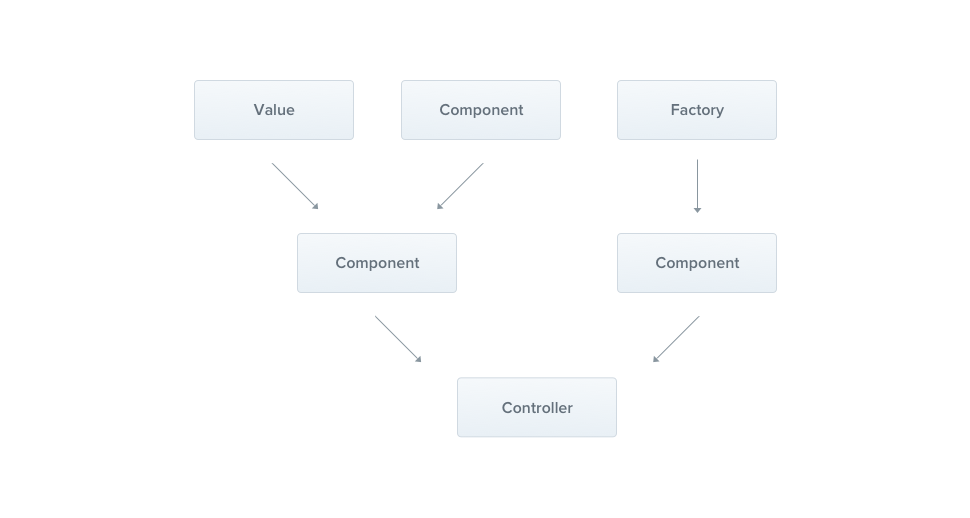
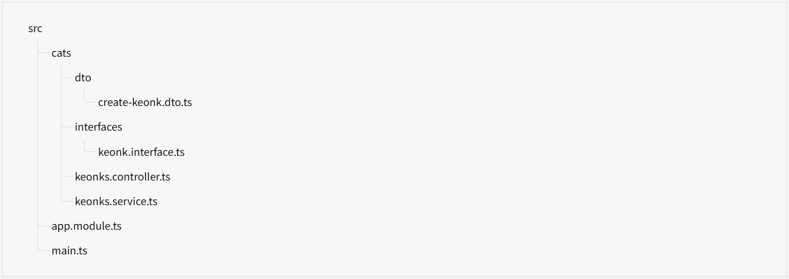

## Providers

Providers are a core concept in Nest. Many of the basic Nest classes, such as services, repositories, factories, and helpers, can be treated as providers. The key idea behind a provider is that it can be injected as a dependency, allowing objects to form various relationships with each other. The responsibility of "wiring up" these objects is largely handled by the Nest runtime system.



In the previous chapter, we created a simple `KeonksController`. Controllers should handle HTTP requests and delegate more complex tasks to providers. Providers are plain JavaScript classes declared as `providers` in a NestJS module. For more details, refer to the "Modules" chapter.

> **Hint**
> Since Nest enables you to design and organize dependencies in an object-oriented manner, we strongly recommend following the **SOLID principles**.

## Services

Let's begin by creating a simple `KeonksService`. This service will handle data storage and retrieval, and it will be used by the `KeonksController`. Because of its role in managing the application's logic, it’s an ideal candidate to be defined as a provider.

```ts
keonks.service.ts;

import { Injectable } from '@nestjs/common';
import { Keonk } from 'src/interfaces/keonk.interface';

@Injectable()
export class KeonksService {
  private readonly keonks: Keonk[] = [];

  create(keonk: Keonk) {
    this.keonks.push(keonk);
  }

  findAll(): Keonk[] {
    return this.keonks;
  }
}
```

> **Hint**
> To create a service using the CLI, simply execute the `$ nest g service keonks` command.

Our KeonksService is a basic class with one property and two methods. The key addition here is the `@Injectable()` decorator. This decorator attaches metadata to the class, signaling that `KeonksService` is a class that can be managed by the Nest IoC container.

Additionally, this example makes use of a Keonk interface, which likely looks something like this:

```ts
interfaces / keonk.interface.ts;

import { Injectable } from '@nestjs/common';
import { Keonk } from 'src/interfaces/keonk.interface';

@Injectable()
export class KeonksService {
  private readonly keonks: Keonk[] = [];

  create(keonk: Keonk) {
    this.keonks.push(keonk);
  }

  findAll(): Keonk[] {
    return this.keonks;
  }
}
```

Now that we have a service class to retrieve keonks, let's use it inside the `KeonksController`:

```ts
interfaces / keonk.interface.ts;

import { Injectable } from '@nestjs/common';
import { Keonk } from 'src/interfaces/keonk.interface';

@Injectable()
export class KeonksService {
  private readonly keonks: Keonk[] = [];

  create(keonk: Keonk) {
    this.keonks.push(keonk);
  }

  findAll(): Keonk[] {
    return this.keonks;
  }
}
```

Now that we have a service class to retrieve keonks, let's use it inside the `KeonksController`:

```ts
import { Controller, Get, Post, Body } from '@nestjs/common';
import { KeonksService } from './keonks.service';
import { CreateKeonkDto } from './create-keonk.dto';
import { Keonk } from 'src/interfaces/keonk.interface';

@Controller('keonks')
export class KeonksController {
  constructor(private keonksService: KeonksService) {}

  @Post()
  async create(@Body() createKeonkDto: CreateKeonkDto) {
    this.keonksService.create(createKeonkDto);
  }

  @Get()
  async findAll(): Promise<Keonk[]> {
    return this.keonksService.findAll();
  }
}
```

The `KeonksService` is injected through the class constructor. Notice the use of the `private` keyword. This shorthand allows us to both declare and initialize the `keonksService` member in the same line, streamlining the process.

## Dependency injection

Nest is built around the powerful design pattern known as **Dependency Injection**. We highly recommend reading a great article about this concept in the official [Angular documentation](https://angular.dev/guide/di).

In Nest, thanks to TypeScript's capabilities, managing dependencies is straightforward because they are resolved based on their type. In the example below, Nest will resolve the `keonksService` by creating and returning an instance of `KeonksService` (or, in the case of a singleton, returning the existing instance if it has already been requested elsewhere). This dependency is then injected into your controller's constructor (or assigned to the specified property):

```ts

constructor(private keonksService: KeonksService) {}

```

## Scopes

Providers typically have a lifetime ("scope") that aligns with the application lifecycle. When the application is bootstrapped, each dependency must be resolved, meaning every provider gets instantiated. Similarly, when the application shuts down, all providers are destroyed. However, it’s also possible to make a provider **request-scoped**, meaning its lifetime is tied to a specific request rather than the application's lifecycle. You can learn more about these techniques in the [Injection Scopes](https://docs.nestjs.com/fundamentals/injection-scopes) chapter.

## Custom providers

Nest comes with a built-in inversion of control ("IoC") container that manages the relationships between providers. This feature is the foundation of dependency injection, but it’s actually much more powerful than we've covered so far. There are several ways to define a provider: you can use plain values, classes, and both asynchronous or synchronous factories. For more examples of defining providers, check out the [Dependency Injection](https://docs.nestjs.com/fundamentals/dependency-injection) chapter.

## Optional providers

Occasionally, you may have dependencies that don't always need to be resolved. For example, your class might depend on a **configuration object**, but if none is provided, default values should be used. In such cases, the dependency is considered optional, and the absence of the configuration provider should not result in an error.

To mark a provider as optional, use the `@Optional()` decorator in the constructor's signature.

```ts
import { Injectable, Optional, Inject } from '@nestjs/common';

@Injectable()
export class HttpService<T> {
  constructor(@Optional() @Inject('HTTP_OPTIONS') private httpClient: T) {}
}
```

In the example above, we're using a custom provider, which is why we include the `HTTP_OPTIONS` custom **token**. Previous examples demonstrated constructor-based injection, where a dependency is indicated through a class in the constructor.

## Property-based injection

The technique we've used so far is called constructor-based injection, where providers are injected through the constructor method. In certain specific cases, **property-based injection** can be useful. For example, if your top-level class depends on one or more providers, passing them all the way up through `super()` in sub-classes can become cumbersome. To avoid this, you can use the `@Inject()` decorator directly at the property level.

```ts
import { Injectable, Inject } from '@nestjs/common';

@Injectable()
export class HttpService<T> {
  @Inject('HTTP_OPTIONS')
  private readonly httpClient: T;
}
```

> **Warning**
> If your class doesn't extend another class, it's generally better to use **constructor-based** injection. The constructor clearly specifies which dependencies are required, offering better visibility and making the code easier to understand compared to class properties annotated with `@Inject`.

## Provider registration

Now that we've defined a provider (`KeonksService`) and a consumer (`KeonksController`), we need to register the service with Nest so that it can handle the injection. This is done by editing the module file (`app.module.ts`) and adding the service to the `providers` array in the `@Module()` decorator.

```ts
app.module.ts;

import { Module } from '@nestjs/common';
import { KeonksController } from './keonks/keonks.controller';
import { KeonksService } from './keonks/keonks.service';

@Module({
  controllers: [KeonksController],
  providers: [KeonksService],
})
export class AppModule {}
```

Nest will now be able to resolve the dependencies of the `KeonksController` class.

At this point, our directory structure should look like this:



## Manual instantiation

So far, we've covered how Nest automatically handles most of the details of resolving dependencies. However, in some cases, you might need to step outside of the built-in Dependency Injection system and manually retrieve or instantiate providers. Two such techniques are briefly discussed below.

- To retrieve existing instances or instantiate providers dynamically, you can use the [Module reference](https://docs.nestjs.com/fundamentals/module-ref).
- To get providers within the `bootstrap()` function (e.g., for standalone applications or to use a configuration service during bootstrapping), check out [Standalone applications](https://docs.nestjs.com/standalone-applications).