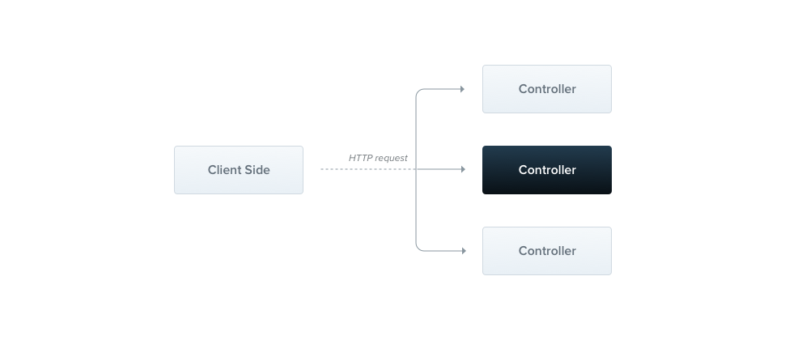

## Controllers



Controllers are responsible for handling **incoming requests** and **sending responses** back to the client.

> **Hint**
> To quickly create a CRUD controller with built-in validation, you can use the CLI's CRUD generator `nest g resource [name]`.

## Routing

To create a basic controller, we use the @Controller() decorator.
You can add a route prefix like `@Controller('keonk')` to group related endpoints `(/keonk)`.

```ts
keonk.controller.ts;

import { Controller, Get } from '@nestjs/common';

@Controller('keonk')
export class KeonkController {
  @Get()
  findAll(): string {
    return 'Keonk response';
  }
}
```

> **Hint**
> To create a controller using the CLI, simply execute the `nest g controller [name]`.

## Request Object

Handlers often need access to the client’s **request** details. Nest provides access to the **request object** from the underlying platform (Express by default). You can access the request object by instructing Nest to inject it using the `@Req()` decorator in the handler’s signature.

```ts
keonk.controller.ts;

import { Controller, Get, Req } from '@nestjs/common';
import { Request } from 'express';

@Controller('keonk')
export class KeonkController {
  @Get()
  findAll(@Req() request: Request): string {
    console.log(request.method);
    console.log(request.url);
    console.log(request.headers);
    return 'Keonk response';
  }
}
```

> **Hint**
> To take advantage of **express** typings (like in the **request: Request** parameter example above), make sure to install the **@types/express** package.

The request object represents the HTTP request and contains properties for the query string, parameters, HTTP headers, and body. In most cases, you don't need to manually access these properties. Instead, you can use dedicated decorators like **@Body()** or **@Query()**, which are available out of the box. Below is a list of the provided decorators and the corresponding platform-specific objects they represent.

| Decorator                 | Value                               |
| ------------------------- | ----------------------------------- |
| `@Request()`, `@Req()`    | `req`                               |
| `@Response()`, `@Res()`\* | `res`                               |
| `@Next()`                 | `next`                              |
| `@Session()`              | `req.session`                       |
| `@Param(key?: string)`    | `req.params` / `req.params[key]`    |
| `@Body(key?: string)`     | `req.body` / `req.body[key]`        |
| `@Query(key?: string)`    | `req.query` / `req.query[key]`      |
| `@Headers(name?: string)` | `req.headers` / `req.headers[name]` |
| `@Ip()`                   | `req.ip`                            |
| `@HostParam()`            | `req.hosts`                         |

## Resources

Earlier, we defined an endpoint to fetch the keonk resource (GET route). We'll typically also want to provide an endpoint that creates new records. For this, let's create the POST, PUT, DELETE handler:

```ts
keonk.controller.ts;

import { Controller, Get, Post, Put, Delete, Req, Param } from '@nestjs/common';
import { Request } from 'express';

@Controller('keonk')
export class KeonkController {
  @Post()
  create(): string {
    return 'Membuat keonk baru';
  }

  @Put(':id')
  update(@Param('id') id: string): string {
    return `Keonk dengan ID ${id} telah diperbarui`;
  }

  @Delete(':id')
  remove(@Param('id') id: string): string {
    return `Keonk dengan ID ${id} telah dihapus`;
  }

  @Get()
  findAll(@Req() request: Request): string {
    console.log(request.method);
    console.log(request.url);
    console.log(request.headers);
    return 'Keonk response';
  }
}
```

It's that simple. Nest provides decorators for all of the standard HTTP methods: `@Get()`, `@Post()`, `@Put()`, `@Delete()`, `@Patch()`, `@Options()`, and `@Head()`. In addition, `@All()` defines an endpoint that handles all of them.

## Route wildcards

Pattern-based routes are also supported in NestJS. For example, the asterisk (`*`) can be used as a wildcard to match any combination of characters in a route at the end of a path. In the following example, the `handleWildcard()` method will be executed for any route that starts with `abcd/`, regardless of the number of characters that follow.

```ts
  @Get('abcd/*')
  handleWildcard(): string {
    return 'When Get abcd/keonk abcd/meonk abcd/miaw or abcd/* anythings';
  }
```

## Status code

As mentioned, the default status code for responses is always 200, except for POST requests, which default to 201. You can easily change this behavior by using the `@HttpCode(...)` decorator at the handler level.

```ts
  @Post()
  @HttpCode(202)
  create(): string {
      return 'Membuat keonk baru';
  }
```

> **Hint**
> Import `HttpCode` from the` @nestjs/common` package.

## Response headers

To specify a custom response header, you can either use a `@Header()` decorator or a library-specific response object (and call `res.header()` directly).

```ts
  @Post()
  @Header('Cache-Control', 'no-store')
  create(): string {
      return 'Membuat keonk baru';
  }
```

> **Hint**
> Import `Header` from the` @nestjs/common package`.

## Redirection

To redirect a response to a specific URL, you can either use a `@Redirect()` decorator or a library-specific response object (and call `res.redirect()` directly).

`@Redirect()` takes two arguments, `url` and `statusCode`, both are optional. The default value of `statusCode` is `302` (`Found`) if omitted.

```ts
  @Get('portfolio')
  @Redirect('https://bagoes.dev', 301)
  redirectPortfolio(): void { }
```

> **Hint**
> Sometimes you may want to determine the HTTP status code or the redirect URL dynamically. Do this by returning an object following the `HttpRedirectResponse` interface (from `@nestjs/common`).

Returned values will override any arguments passed to the `@Redirect()` decorator. For example:

```ts
  @Get('docs')
  @Redirect('https://docs.nestjs.com', 302)
  getDocs(@Query('version') version) {
    if (version && version === '5') {
     return { url: 'https://docs.nestjs.com/v5' };
    }
  }

```

## Route parameters

Routes with static paths won’t work when you need to accept dynamic data as part of the request (e.g., `GET /keonk/1` to get the cat with id `1`). To define routes with parameters, you can add route parameter **tokens** in the route path to capture the dynamic values from the URL. The route parameter token in the `@Get()` decorator example below illustrates this approach. These route parameters can then be accessed using the `@Param()` decorator, which should be added to the method signature.

> **Hint**
> Routes with parameters should be declared after any static paths. This prevents the parameterized paths from intercepting traffic destined for the static paths.

```ts
  @Get(':id')
  findOne(@Param() params: any): string {
    console.log(params.id);
    return `This action returns a #${params.id} keonk`;
  }
```

The `@Param()` decorator is used to decorate a method parameter (in the example above, `params`), making the route parameters accessible as properties of that decorated method parameter inside the method. As shown in the code, you can access the `id` parameter by referencing `params.id`. Alternatively, you can pass a specific parameter token to the decorator and directly reference the route parameter by name within the method body.

> **Hint**
> Import `Param` from the `@nestjs/common` package.

```ts
  @Get(':id')
  findOne(@Param('id') id: string): string {
    return `This action returns a #${id} keonk`;
  }
```

## Sub-domain routing

The `@Controller` decorator can take a host option to require that the HTTP host of the incoming requests matches some specific value.

```ts
@Controller({ host: 'etmin.example.com' })
export class KeonkController {
  @Get()
  index(): string {
    return 'Keonk akan merespon jika host berasal dari etmin.example.com';
  }
}
```

Similar to a route `path`, the `host` option can use tokens to capture the dynamic value at that position in the host name. The host parameter token in the `@Controller()` decorator example below demonstrates this usage. Host parameters declared in this way can be accessed using the `@HostParam()` decorator, which should be added to the method signature.

```ts
@Controller({ host: ':account.example.com' })
export class KeonkController {
  @Get()
  getInfo(@HostParam('account') account: string) {
    return account;
  }
}
```

## State Sharing

For developers coming from other programming languages, it might be surprising to learn that in Nest, nearly everything is `shared across incoming requests`. This includes resources like the database connection pool, `singleton services` with global state, and more. It's important to understand that Node.js doesn't use the request/response `Multi-Threaded Stateless Model`, where each request is handled by a separate thread. As a result, using singleton instances in Nest is completely safe for our applications.

That said, there are specific edge cases where having request-based lifetimes for controllers may be necessary. Examples include per-request caching in GraphQL applications, request tracking, or implementing multi-tenancy.

## Asynchronicity

We love modern JavaScript, especially its emphasis on **asynchronous** data handling. That’s why Nest fully supports `async` functions. Every `async` function must return a `Promise`, which allows you to return a deferred value that Nest can resolve automatically. Here's an example:

```ts
keonk.controller.ts;

  @Get()
  async findAll(): Promise<any[]> {
      return [];
  }
```

This code is perfectly valid. But Nest takes it a step further by allowing route handlers to return RxJS **observable streams** as well. Nest will handle the subscription internally and resolve the final emitted value once the stream completes.

```ts
keonk.controller.ts;

  @Get()
  async findAll(): Observable<any[]> {
      return of([]);
  }
```

Both approaches are valid, and you can choose the one that best suits your needs.
